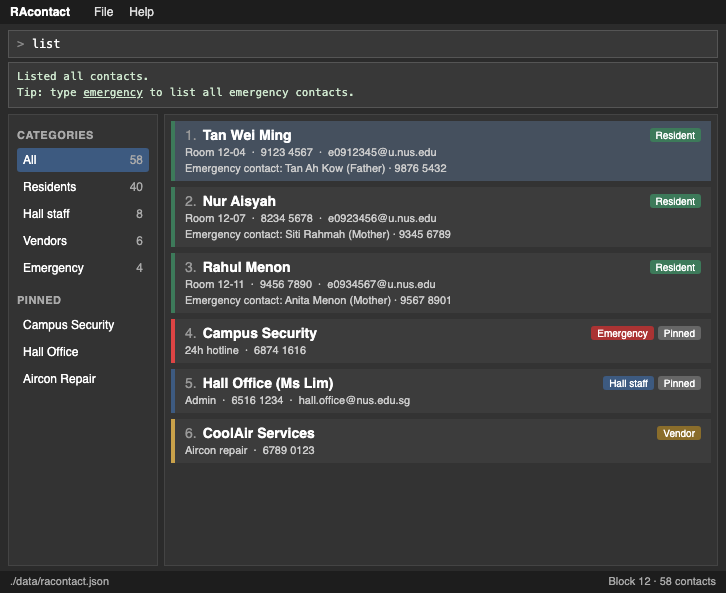

**RAcontact is a desktop contact management app for Residential Assistants (RAs) at NUS hostels.** It keeps the contacts an RA needs on duty (residents, fellow RAs, hall staff, vendors and emergency services) in one organised place, instead of scattered across chats and documents.

**Target user profile:** Residential assistants at NUS hostels who manage contacts for residents, hall staff, vendors, and emergency services. They handle incidents and welfare cases during duty shifts, where knowing who to contact next is critical and where a resident's details need to be at hand immediately.

**Value proposition:** Residential assistants keep track of contacts for residents, hall staff, vendors, and emergency services, currently scattered across chats and documents. This app brings them together in one organised place, optimised for typing so the right person or resident's details can be retrieved in seconds during an emergency.

* It is **optimised for fast typists**: most interactions happen through a Command Line Interface (CLI), so the right resident's details or the hall's on-call number can be retrieved in seconds during an emergency, without reaching for the mouse.
* It still has a Graphical User Interface (GUI) for viewing contacts at a glance.
* RAcontact focuses on storing, organising and retrieving contacts. It does not send messages, make calls, store incident reports or schedule duty rosters.

For more details, see the **[RAcontact Product Website](https://ay2627s1-cs2103t-f10-1.github.io/tp/)**:
* If you are interested in using RAcontact, head over to the [_Quick Start_ section of the **User Guide**](https://ay2627s1-cs2103t-f10-1.github.io/tp/UserGuide.html#quick-start).
* If you are interested in developing RAcontact, the [**Developer Guide**](https://ay2627s1-cs2103t-f10-1.github.io/tp/DeveloperGuide.html) is a good place to start.

**Acknowledgements**

* This project is based on the AddressBook-Level3 project created by the [SE-EDU initiative](https://se-education.org).
* Libraries used: [JavaFX](https://openjfx.io/), [Jackson](https://github.com/FasterXML/jackson), [JUnit5](https://github.com/junit-team/junit5)
